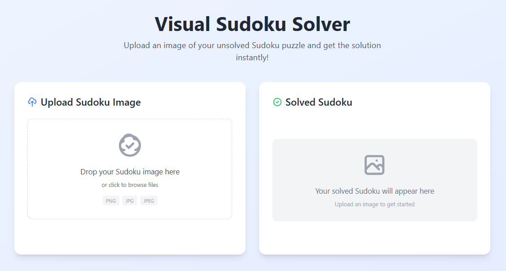
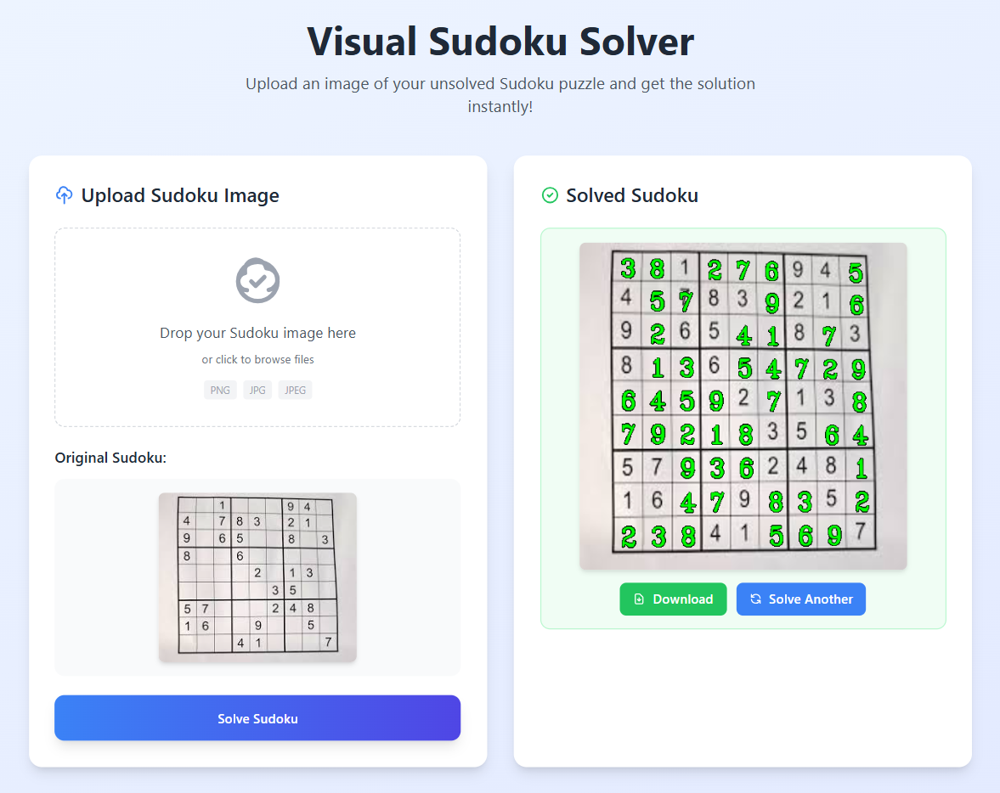

# AI Sudoku Solver & AR Overlay

A robust Computer Vision application that detects, interprets, and solves Sudoku puzzles from real-time video feeds (screenshots) or static images. It integrates a custom Convolutional Neural Network (CNN) for digit recognition with OpenCV for image processing, projecting the solution back onto the original image in an Augmented Reality (AR) style.

## Key Features

- **Real-time Grid Detection**: Automatically locates Sudoku boards in video streams using adaptive thresholding and contour analysis.
- **Perspective Warping**: Corrects camera angles to generate a flat, top-down view of the board for processing.
- **Custom CNN Architecture**: A dedicated TensorFlow model trained on augmented digit datasets for high-accuracy recognition (>98%).
- **Smart Noise Filtering**: Implements heuristic algorithms (pixel density & variance analysis) to accurately distinguish empty cells from filled ones.
- **AR Solution Overlay**: Solves the puzzle mathematically and projects the missing numbers back onto the original frame with correct perspective alignment.

## Tech Stack

- **Language**: Python
- **Computer Vision**: OpenCV (Contours, Warp Perspective, Gaussian Blur, Morphology)
- **Deep Learning**: TensorFlow/Keras (CNN, Data Augmentation, Callbacks)
- **Data Processing**: NumPy, Scikit-learn
- **Visualization**: Matplotlib

## How It Works

### 1. Vision Pipeline (utils.py)

The system treats the visual input as a raw canvas to extract the puzzle:

- **Preprocessing**: Converts images to grayscale and applies Gaussian Blur to reduce noise.
- **Adaptive Thresholding**: Locates grid lines effectively even under uneven lighting or shadows.
- **Contour Analysis**: Identifies the largest 4-sided polygon to isolate the board.
- **Warp Perspective**: Transforms the skewed board into a flat $450 \times 450$ square.

### 2. The Brain: CNN Model (training.py)

A custom Convolutional Neural Network interprets the digits:

- **Architecture**: 2x `Conv2D layers` ($5 \times 5$), `MaxPooling`, `Dropout (0.3)` for regularization, and `Softmax` output.
- **Training**: Trained on a dataset of digits with heavy augmentation (rotation, zoom, shear) to handle orientation variations.
- **Validation**: Uses `EarlyStopping` and `ReduceLROnPlateau` to prevent overfitting and optimize convergence.

### 3. Solving & Overlay

- **Empty Cell Logic**: A custom `isEmptyCell` function analyzes the center of each grid square. It checks pixel density and standard deviation to filter out noise, ensuring empty squares aren't mistaken for digits.
- **Solving**: A backtracking algorithm fills the logic board.
- **Projection**: The solved digits are drawn on a blank mask and warped back to the original image's perspective using the inverse transformation matrix.

## Getting Started

### Prerequisites

Ensure you have the required libraries installed:

```bash
pip install opencv-python numpy tensorflow matplotlib scikit-learn
```

### Installation

Clone the repository:

```bash
git clone https://github.com/dakshgoel2008/Visual_Sudoku_Solver.git
cd Visual_Sudoku_Solver
```

### Train the Model (Optional)

The project comes with a pre-trained model. To retrain it:

```bash
python CNN_Digit_Classifier/training.py
```

### Run the Flask app

```bash
python app.py
```

Open your browser and navigate to `http://127.0.0.1:5000` to access the web interface.

## Model Performance

The CNN was trained with the following configuration:

- **Input**: `32 x 32 x 1` Grayscale images
- **Optimizer**: Adam (lr=0.001)
- **Loss**: Categorical Crossentropy
- **Results**: ~99% Accuracy on Validation Set

## Future Improvements

- Enhance recognition for handwritten digits (currently optimized for printed fonts).
- Optimize model size for mobile deployment (TFLite).
- Add support for detecting multiple Sudoku grids in a single frame.



